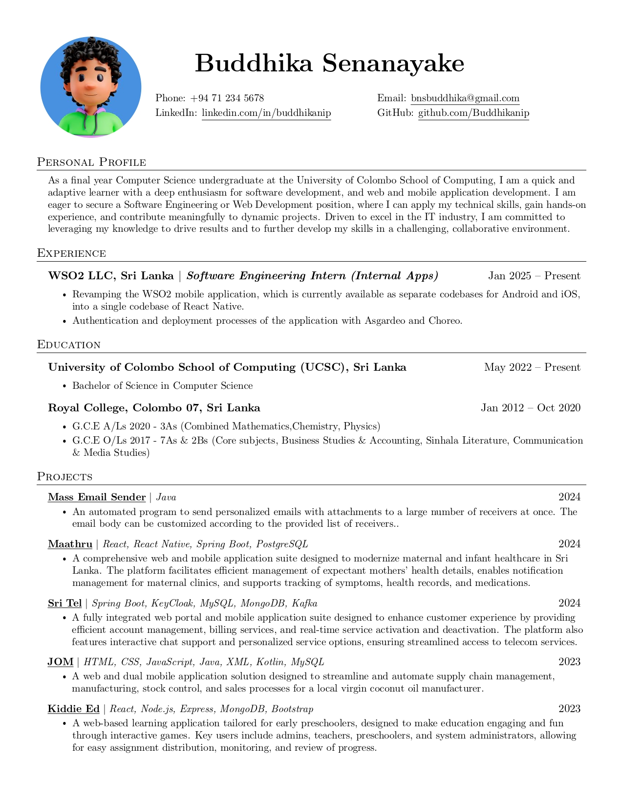
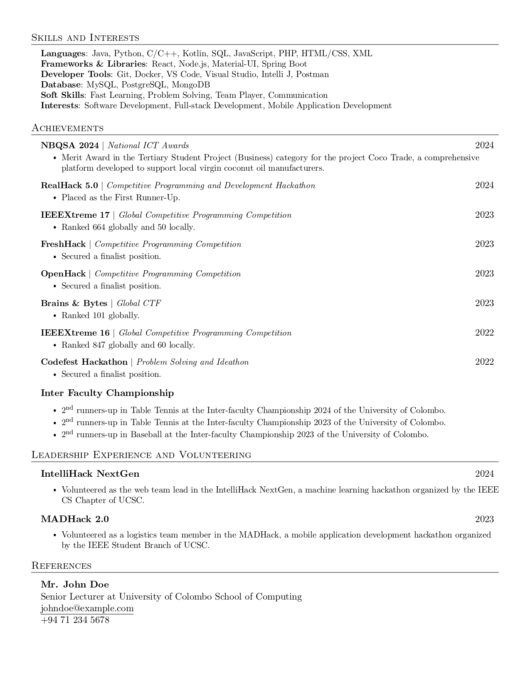

# LaTeX Resume Template

A clean, professional, and ATS-friendly LaTeX resume template with modular structure for easy customization.

### Preview (without photo)


### Preview (with photo)



## Features

- **ATS-Friendly**: Machine-readable PDF output optimized for Applicant Tracking Systems
- **Modular Design**: Separate files for each section allowing easy customization
- **Professional Layout**: Clean, modern design suitable for various industries
- **Photo Support**: Optional profile photo with rounded border
- **Customizable Sections**: Easy to add, remove, or modify sections
- **Well-Documented**: Clear code structure with helpful comments

## Quick Start

### Option 1: Using Overleaf (Recommended for beginners)
1. Download this repository as ZIP
2. Upload to [Overleaf](https://www.overleaf.com)
3. Compile and start editing!

### Option 2: Local LaTeX Installation
1. Clone this repository:
   ```bash
   git clone https://github.com/Buddhikanip/resume.git
   cd resume
   ```
2. Compile the resume:
   ```bash
   pdflatex resume.tex
   ```

## File Structure

```
├── resume.tex              # Main LaTeX file
├── resume.pdf              # Your resume pdf file
├── content/                # Individual section files
│   ├── heading.tex         # Name and contact information
│   ├── about.tex           # Personal profile/summary
│   ├── experience.tex      # Work experience
│   ├── education.tex       # Educational background
│   ├── projects.tex        # Projects section
│   ├── skills.tex          # Technical skills
│   ├── achievements.tex    # Awards and achievements
│   ├── extra.tex           # Leadership & volunteering
│   └── references.tex      # References section
├── images/                 # Directory for profile photo
└── README.md               # This file
```

## Customization Guide

### 1. Personal Information
Edit `content/heading.tex` to update your contact details:

```latex
\textbf{\Huge \scshape Your Name} \\ \vspace{1pt}
\small \href{tel:+1234567890}{+1 234 567 890} $|$ 
\href{mailto:your.email@example.com}{\underline{your.email@example.com}} $|$ 
\href{https://linkedin.com/in/yourprofile}{\underline{linkedin.com/in/yourprofile}} $|$
\href{https://github.com/yourusername}{\underline{github.com/yourusername}}
```

### 2. Adding a Profile Photo
1. Place your photo in the `images/` directory (e.g., `images/your_photo.jpg`)
2. In `content/heading.tex`, comment out the "WITHOUT PHOTO" section
3. Uncomment the "WITH PHOTO" section and update the image path:
   ```latex
   \node at (0,0) {\includegraphics[width=0.2\textwidth]{images/your_photo.jpg}};
   ```

### 3. Customizing Sections

#### Adding Work Experience
In `content/experience.tex`:
```latex
\resumeCustomSubheading
  {\textbf{Company Name} $|$ \emph{Job Title}}{Start Date -- End Date}
  \resumeItemListStart
    \resumeItem{Description of your responsibilities and achievements}
    \resumeItem{Another achievement with quantifiable results}
  \resumeItemListEnd
```

#### Adding Projects
In `content/projects.tex`:
```latex
\resumeProjectHeading
  {\textbf{Project Name} $|$ \emph{Technologies Used}}{Date}
  \resumeItemListStart
    \resumeItem{Brief description of the project and your contributions}
    \resumeItem{Technologies used: React, Node.js, MongoDB, etc.}
  \resumeItemListEnd
```

#### Adding Skills
In `content/skills.tex`:
```latex
\resumeSubHeadingListStart
  \resumeItem{\textbf{Languages:} JavaScript, Python, Java, C++}
  \resumeItem{\textbf{Frameworks:} React, Node.js, Express, Django}
  \resumeItem{\textbf{Databases:} MySQL, MongoDB, PostgreSQL}
\resumeSubHeadingListEnd
```

### 4. Adding/Removing Sections
To add a new section:
1. Create a new file in the `content/` directory (e.g., `content/certifications.tex`)
2. Add the input command in `resume.tex`:
   ```latex
   %-----------CERTIFICATIONS-----------
   \input{content/certifications}
   ```

To remove a section, simply comment out or delete the corresponding `\input{}` line in `resume.tex`.

### 5. Styling Customizations

#### Changing Colors
Add color definitions after the packages:
```latex
\definecolor{primarycolor}{RGB}{0, 100, 200}
\titleformat{\section}{
  \vspace{-4pt}\scshape\raggedright\large
}{}{0em}{}[\color{primarycolor}\titlerule \vspace{-5pt}]
```

#### Adjusting Margins
Modify the margin adjustments in `resume.tex`:
```latex
\addtolength{\oddsidemargin}{-0.5in}    % Left margin
\addtolength{\evensidemargin}{-0.5in}   # Right margin
\addtolength{\textwidth}{1in}           # Text width
\addtolength{\topmargin}{-.5in}         # Top margin
\addtolength{\textheight}{1.0in}        # Text height
```

## Available Commands

- `\resumeSubheading{Title}{Date}{Subtitle}{Location}` - For experience entries
- `\resumeCustomSubheading{Title}{Date}` - For custom entries
- `\resumeProjectHeading{Title}{Date}` - For projects
- `\resumeItem{Description}` - For bullet points
- `\resumeSubItem{Description}` - For sub-bullet points

## Tips for ATS Optimization

1. **Use standard section headings**: "Experience", "Education", "Skills"
2. **Include relevant keywords** from job descriptions
3. **Use simple formatting** - avoid complex graphics or unusual fonts
4. **Save as PDF** to preserve formatting
5. **Test your resume** with online ATS checkers

## Dependencies

This template requires the following LaTeX packages:
- `latexsym`, `fullpage`, `titlesec`, `marvosym`, `color`
- `verbatim`, `enumitem`, `hyperref`, `fancyhdr`
- `babel`, `tabularx`, `graphicx`, `tikz`

Most LaTeX distributions (TeXLive, MiKTeX) include these packages by default.

## Troubleshooting

### Common Issues

**Issue**: "File not found" errors
- **Solution**: Ensure all files are in the correct directory structure

**Issue**: Photo not displaying
- **Solution**: Check that the image file exists and the path is correct in `heading.tex`

**Issue**: Compilation errors
- **Solution**: Make sure you have all required packages installed

**Issue**: Spacing problems
- **Solution**: Adjust `\vspace{}` commands in the relevant sections

## Contributing

Feel free to:
- Report bugs by opening an issue
- Submit improvements via pull requests
- Share your customized versions

## License

This project is licensed under the MIT License - see the [LICENSE](LICENSE) file for details.

## Acknowledgments

- Based on the excellent template by [sb2nov/resume](https://github.com/sb2nov/resume)
- Use it on overleaf: [Jake's Resume](https://www.overleaf.com/latex/templates/jakes-resume/syzfjbzwjncs) (Original template)
- Inspired by modern resume design trends

## Support

If you find this template helpful, please consider:
- ⭐ Starring this repository
- 🐛 Reporting any issues you encounter
- 🚀 Sharing improvements or customizations

---

**Happy job hunting! 🎯**